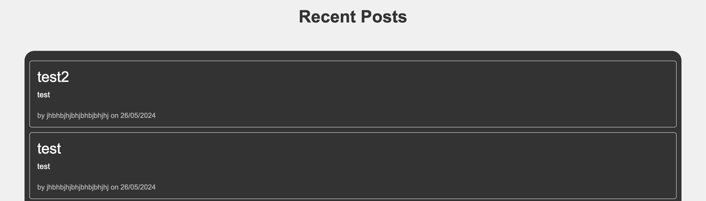
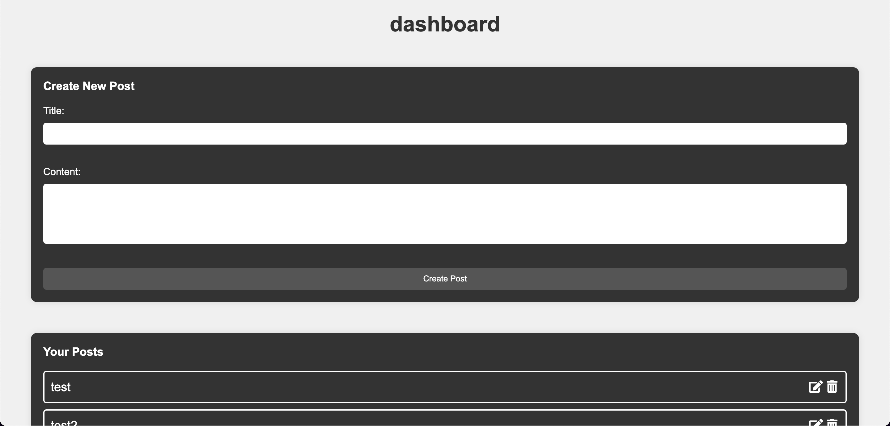
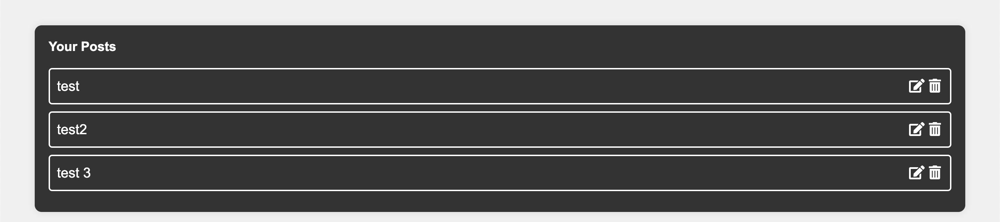
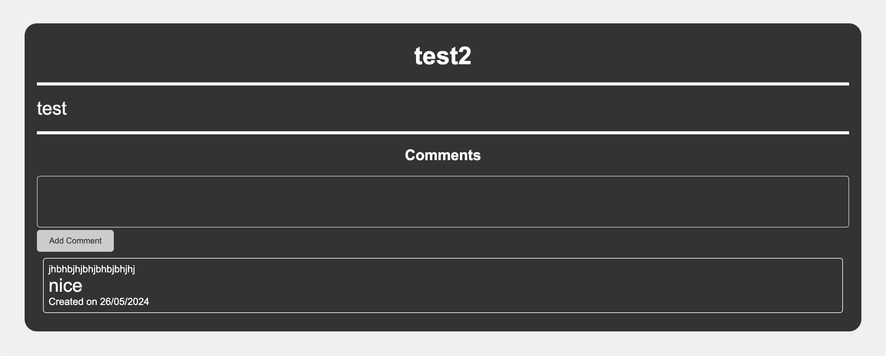

## Tech Blog

Tech Blog is a web application for sharing and viewing technology-related blog posts and comments. It allows users to create accounts, log in, create new posts, view posts, and interact with other users' posts through comments.

## Features

- User Authentication: Users can create accounts and log in securely.
- Post Creation: Logged-in users can create new blog posts.
- Post Viewing: Users can view individual blog posts along with their comments.
- Commenting: Logged-in users can comment on blog posts.
- Homepage: Displays a list of recent blog posts for users to browse.
- Dashboard: Provides a personalized dashboard for logged-in users to manage their posts and comments.

## Technology used

- Express.js
- Handlebars
- Sequelize
- RESTful API
- Javascript
- CSS

## screenshots

